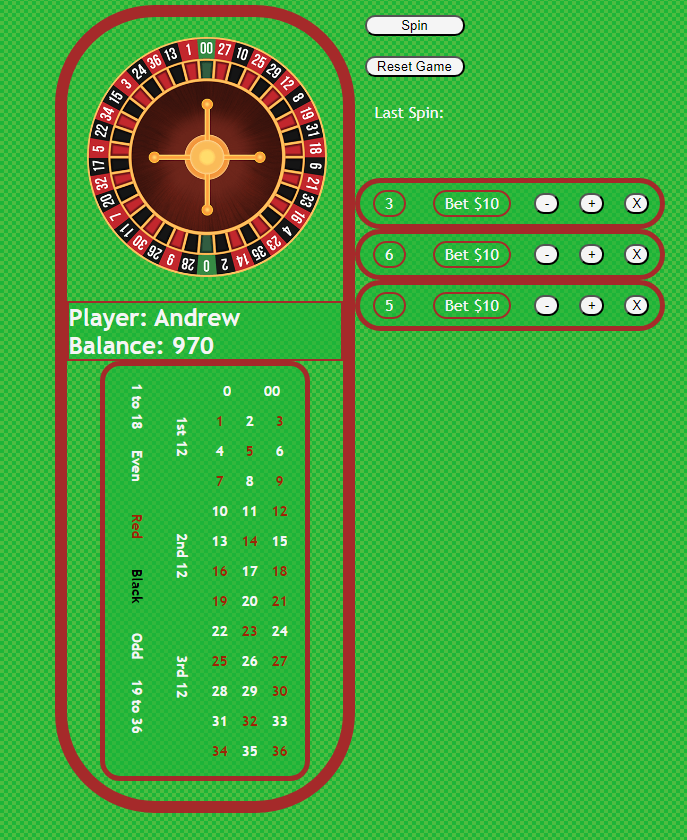

# Roulette
This is a fun simplified version of the game of Roulette!
- Roulette is a Casino Table Game where players place bets on where a spinning wheel will stop.

## [Click Here To Play!](https://andrewr-roulette.netlify.app/)

## How to Play!
## 1. Place Bets
- ### Number Bet - ( 1-36, 0, 00 )
    - Player directly selects a number
    - Pays 35 to 1
- ### Outside Bet
    - Player selects collections of numbers
        - 1 to 18
        - 19 to 36
        - 1st 12
        - 2nd 12
        - 3rd 12
        - Even
        - Odd
        - Red
        - Black

## 2. Spin

- Betting closes and the wheel spins and lands on a number.
- The winning number is displayed, as well as whether the player won or lost.
- Player balance is updated and a new round of betting begins.

## Technologies
- HTML, CSS, Javascript, Git

## Attributions
- Favicon
    - https://www.flaticon.com/search?word=roulette
- Roulette Wheel
    - freeimages.com
- Background Pattern
    - https://heropatterns.com/

## Future Features
- Animations
    - Wheel Spin
    - Chip Movement and Stacking
    - Win / Loss
- More Betting Options
    - Line Bets
    - Sit out
- Multi-Seat Table
    - Play with Computer players
        - Different Strategies
    - Play Online with Other Players
- Player Avatars
- Login and Save Game Functionality
- Additional Themes

[Here's How I planned the game!](https://github.com/AndrewRentschler/Roulette/blob/main/Project%20Planning.txt)
